```markdown
# **Ecommerce Shop**

## **Project Description**  
Ecommerce Shop is an online vegetable shopping platform connecting customers, vendors, and administrators. Customers can browse, purchase, and manage their orders, while vendors can manage inventory and process orders. The platform is designed to provide a seamless, user-friendly shopping experience with advanced security features.

---

## **Technology and Frameworks Used**  
- **Programming Language:** Java  
- **Web Framework:** J2EE (JSP, Servlets, JSTL)  
- **Database:** SQL (DBMS)  
- **Security:** RSA Algorithm (Rivest–Shamir–Adleman)  
- **Web Technologies:** HTML, CSS, JS, Bootstrap, Font Awesome  
- **Server for Deployment:** Apache Tomcat  

---

## **Project Structure**  
```plaintext
E--Commerce-JAVA
├───.settings
├───build
│   └───classes
│       └───com
│           └───vinay
│               ├───controller
│               ├───dao
│               ├───daoImpl
│               ├───exception
│               ├───model
│               │   └───VO
│               ├───service
│               ├───serviceImpl
│               └───util
└───src
    └───main
        ├───java
        │   └───com
        │       └───vinay
        │           ├───controller
        │           ├───dao
        │           ├───daoImpl
        │           ├───exception
        │           ├───model
        │           │   └───VO
        │           ├───service
        │           ├───serviceImpl
        │           └───util
        └───webapp
            ├───META-INF
            ├───WEB-INF
            │   └───lib
            ├───admin
            ├───components
            ├───css
            ├───img
            ├───js
            └───vendor
```

---

## **Project Images**

- **Admin Dashboard**  
  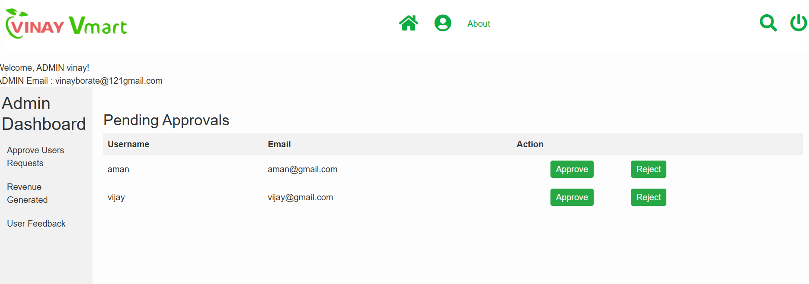

- **Customer Add To Cart**  
  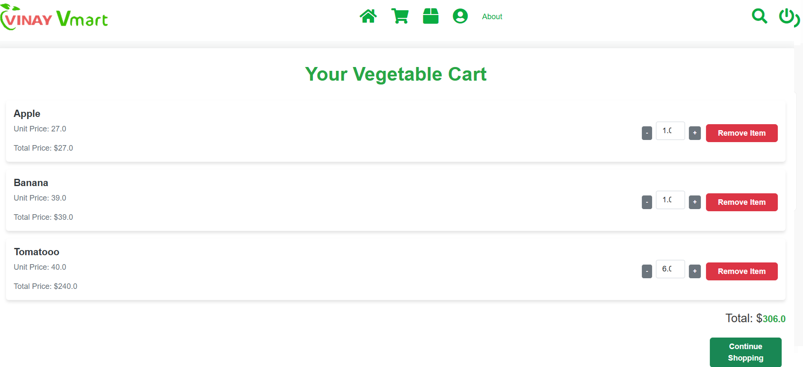

- **Customer Check Out Page**  
  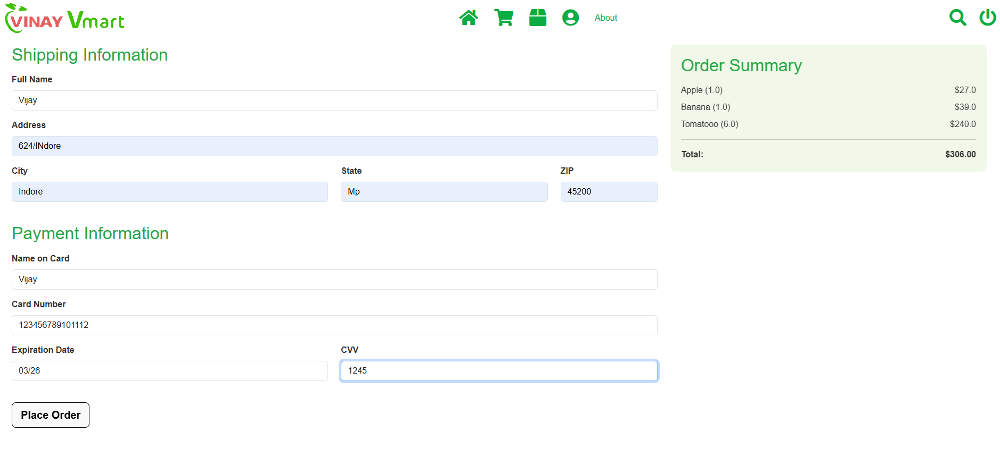

- **Customer Download Bill**  
  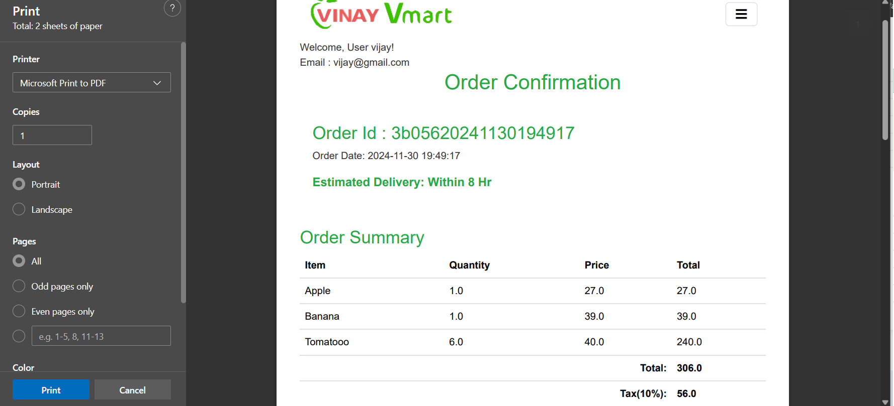

- **Customer Order History**  
  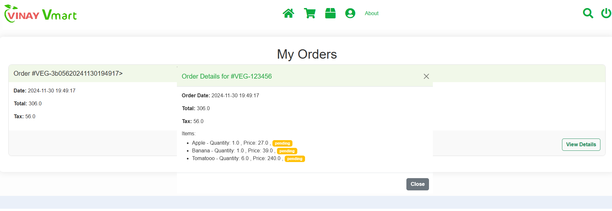

- **Customer Order Confirmation Page**  
  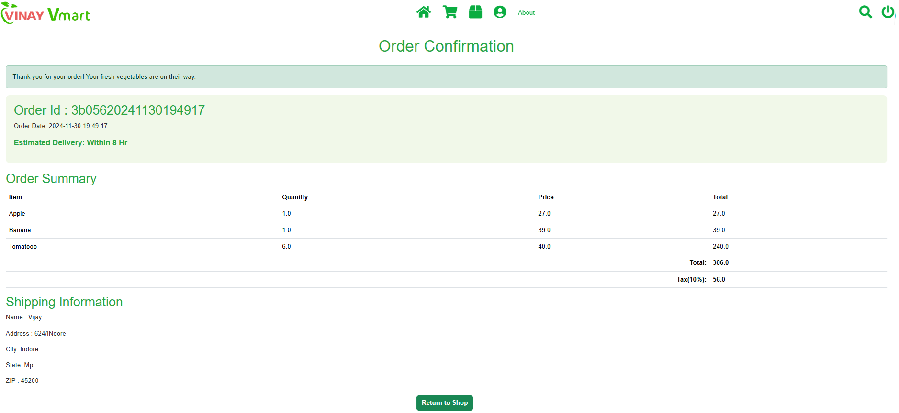

- **Login User**  
  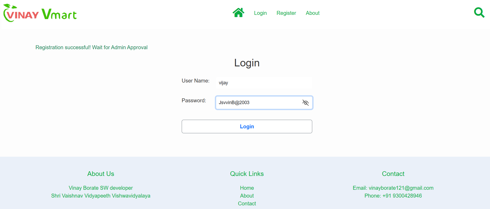

- **Register User**  
  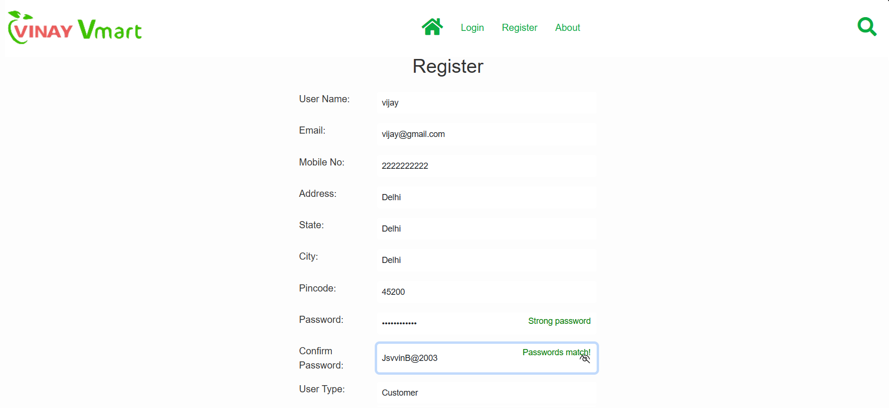

- **Store Home Page**  
  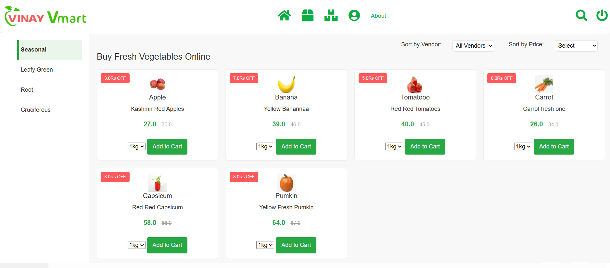

- **Vendor Dashboard**  
  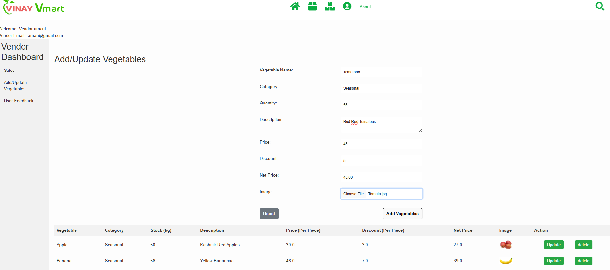

- **Vendor Inventory Dashboard**  
  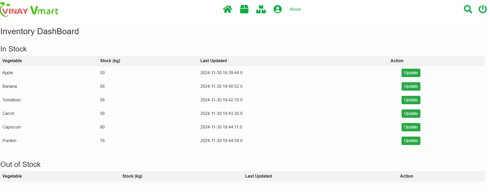

- **Vendor Order History**  
  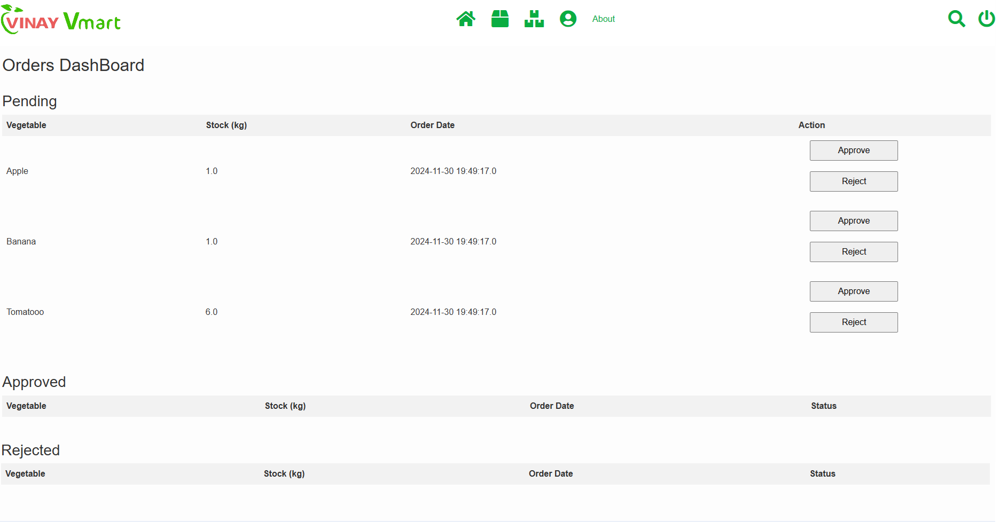

---


## **Steps to Run the Project**  

1. **Clone the Repository**  
   ```bash
   git clone https://github.com/yourusername/ecommerce-shop.git
   cd ecommerce-shop
   ```

2. **Build the Project**  
   Ensure you have **Apache Tomcat** installed and configured.  
   - Deploy the project to the Tomcat server.  
   - Compile Java files using the **Maven** or **Gradle** build system (depending on the configuration).

3. **Run the Application**  
   - Start the Tomcat server and access the application via your browser at `http://localhost:8080`.

4. **Run Tests**  
   The application includes test cases for **login**, **registration**, **cart functionality**, **inventory management**, and **payment processing**.

---

## **Technical Details**  

### **LoginController.java**  
Handles tasks like:  
1. **User Authentication:** Validates login credentials for customers, vendors, and admin.  
   - `authenticateUser(HttpServletRequest request, HttpServletResponse response)`  
2. **Redirect to Role-based Dashboard:** Redirects users to appropriate dashboards based on role.  
   - `redirectToDashboard(HttpServletRequest request, HttpServletResponse response)`  

---

### **ProductController.java**  
Handles tasks like:  
1. **Product Display:** Displays a list of products based on search filters or categories.  
   - `displayProducts(HttpServletRequest request, HttpServletResponse response)`  
2. **Add to Cart:** Manages adding products to the shopping cart.  
   - `addToCart(HttpServletRequest request, HttpServletResponse response)`  
3. **Product Checkout:** Manages the checkout process for customers.  
   - `checkout(HttpServletRequest request, HttpServletResponse response)`  

---

### **AdminController.java**  
Handles admin functionality:  
1. **Approve/Reject Users:** Admin can approve or reject new customer/vendor registrations.  
   - `approveOrRejectUser(HttpServletRequest request, HttpServletResponse response)`  
2. **Manage Orders:** Admin can view and manage orders placed by customers.  
   - `manageOrders(HttpServletRequest request, HttpServletResponse response)`  

---

## **Security**  

### **RSA Encryption:**

The platform uses **RSA encryption** for secure data transmission during login and transactions. This ensures that sensitive data, such as passwords and payment information, is securely transmitted between the client and server.

- **Encryption Process:**  
  - The client encrypts sensitive information (e.g., login credentials, payment details) using the public key.
  - The server decrypts the data using the private key.

- **Database Security:**  
  - All sensitive user data (like passwords) is stored in an encrypted format.
  - The server validates user credentials by comparing the decrypted data with stored information.

---

## **Testing**  

### **Unit Testing**  

The project includes unit tests for:  
1. **User Registration**  
2. **Login Authentication**  
3. **Shopping Cart Operations**  
4. **Order Management**  
5. **Inventory Management**  

Tests can be run through the included **JUnit** test cases, which verify the core functionality of controllers, services, and database interactions.

### **Performance Testing**  

Performance tests ensure that the system can handle large numbers of users, orders, and inventory items without degrading performance. These tests validate:
1. Response time for product search.
2. Time taken for checkout and payment processing.
3. Load testing for admin and vendor dashboards.

---

## **Goals and What I Learned**  

### **Goals Achieved**  
- Developed a fully functional online shopping platform with role-based access.  
- Integrated secure login and payment processing using RSA encryption.  
- Implemented comprehensive unit and performance testing for various components.  

### **Lessons Learned**  
1. **Web Development Skills:** Improved knowledge in building web applications using Java and J2EE.  
2. **Security Best Practices:** Gained understanding of secure data handling using encryption techniques.  
3. **Database Design:** Enhanced skills in designing relational databases for e-commerce applications.  
4. **Testing and Debugging:** Learned the importance of thorough testing and debugging in web applications.

---

Feel free to contribute or suggest improvements!

**[Vinay Borate ](https://github.com/VinayBorate)**

--- 
